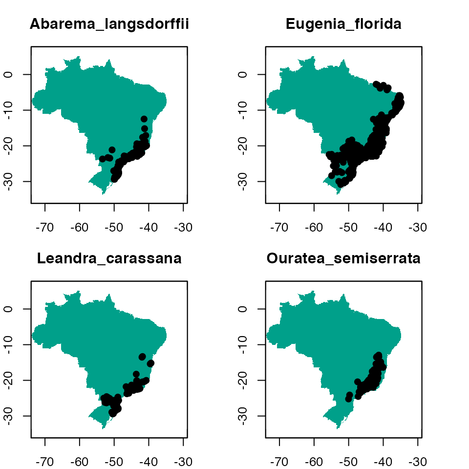
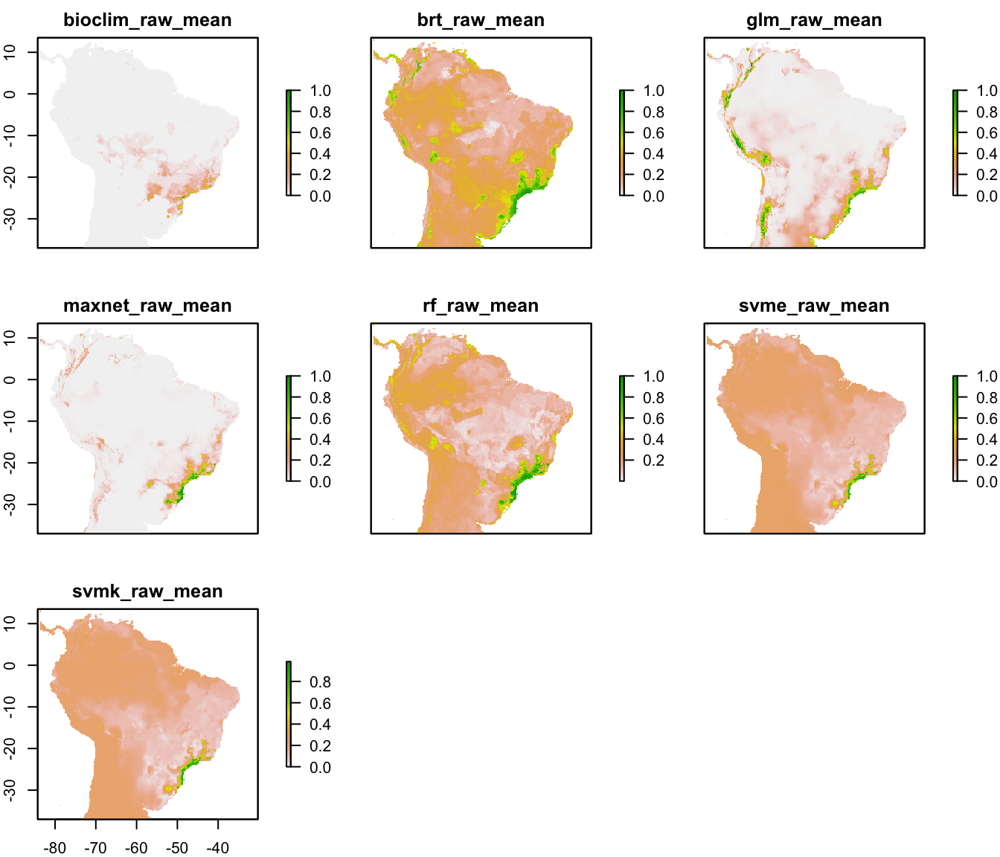
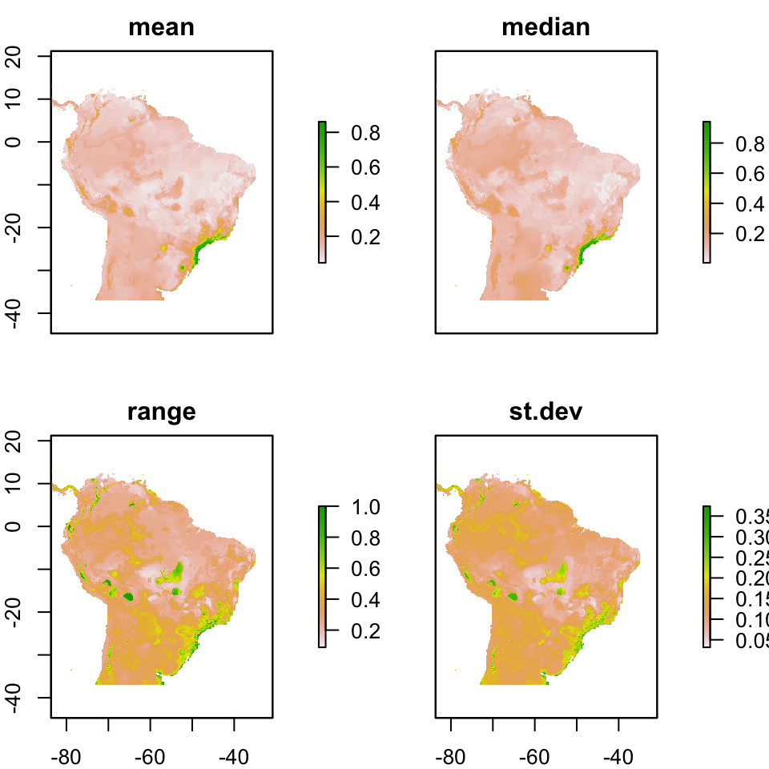

[](https://travis-ci.com/Model-R/modleR)

# modleR: a workflow for ecological niche models based on dismo 

__modleR__ is a workflow based on package __dismo__ (Hijmans et al 2017), designed to automatize some of the common steps when performing ecological niche models. Given the occurrence records and a set of environmental predictors, it prepares the data by cleaning for duplicates, removing occurrences with no environmental information and applying some geographic and environmental filters. It executes crossvalidation or bootstrap procedures, then it performs ecological niche models using several algorithms, some of which are already implemented in the `dismo` package, and others come from other packages in the R environment, such as glm, Support Vector Machines and Random Forests.

# Installing

Currently __modleR__ can be installed from GitHub:

```
# Without vignette
remotes::install_github("Model-R/modleR", build = TRUE)
# With vignette
remotes::install_github("Model-R/modleR",
                        build = TRUE,
                        dependencies = TRUE,
                        build_opts = c("--no-resave-data", "--no-manual"),
                        build_vignettes = TRUE)

```

__Note regarding vignette building__: the default parameters in `build_opts`
include `--no-build-vignettes`. In theory, removing this will include the 
vignette on the installation but we have found that `build_vignettes = TRUE` is
also necessary. During installation, R may ask to install or update some 
packages. If any of these return an error you can install them apart by running
`install.packages()` and retry. When building the vignette, package __rJava__ 
will be needed. Also, make sure that the maxent.jar file is available and in the
`java` folder of package __dismo__. Please download it [here]( 
http://www.cs.princeton.edu/~schapire/maxent/).  Vignette builindg may take a 
while during installation.

# Shiny app

A shiny application currently available at: https://github.com/Model-R/modleR_shiny_app
uses a previous version of this workflow and is currently being updated to this newest version.


# The workflow

The workflow consists of mainly four functions that should be used sequentially.


1. Setup: `setup_sdmdata()` prepares and cleans the data, samples the pseudoabsences, and organizes the experimental design (bootstrap, crossvalidation or repeated crossvalidation). It creates a metadata file with details for the current round and a sdmdata file with the data used for modeling
2. Model fitting and projecting: `do_any()` makes the ENM for one algorithm and partition; optionally, `do_many()` calls `do_any()` to fit multiple algorithms
3. Partition joining: `final_model()` joins the partition models into a model per species per algorithm
4. Ensemble: `ensemble_model()` joins the different models per algorithm into an ensemble model (algorithmic consensus) using several methods.


## Folder structure created by this package

__modleR__ writes the outputs in the hard disk, according to the following folder structure:

```bash
models_dir
├── projection1
│   ├── data_setup
│   ├── ensemble_models
│   ├── final_models
│   └── partitions
└── projection2
    ├── data_setup
    ├── ensemble_models
    ├── final_models
    └── partitions
```

+ We define a _partition_ as the individual modeling round that takes part of the data to train the algorithms and the rest of the data to test them.
+ We define the _final models_ as joining together the partitions and obtaining __one model per species per algorithm__.
+ _Ensemble_ models join together the results obtained by different algorithms (Araújo & New 2007).
+ When projecting models into the present, the projection folder is called `present`.
+ You can set `models_dir` wherever you want in the hard disk, but if you do not modify the default value, it will create the output under the working directory (its default value is `./models`, where the period points to the working directory)
+ The _names_ of the `final` and `ensemble` folders can be modified, but __the nested subfolder structure will remain the same__. If you change `final_models` default value (`"final_model"`) you will need to include the new value when calling `ensemble_model()` (`final_dir = "[new name]"`), to indicate the function where to look for models. This partial flexibility allows for experimenting with final model and ensemble construction (by runnning final or ensemble twice in different output folders, for example).


##  Cleaning and setting up the data: `setup_sdmdata()`

The first step of the workflow is to setup the data, that is, to partition it
according to each project needs, to sample background pseudoabsences and to
apply some data cleaning procedures, as well as some filters. This is done by
function `setup_sdmdata()`


__modleR__ comes with example data, a list called `example_occs`, with
occurrence data for four species, and predictor variables called
`example_vars`


```{r lib, echo = TRUE, eval = TRUE}
library(modleR)
str(example_occs)
species <- names(example_occs)
species
```


```{r dataset, fig.width = 5, fig.height = 5, fig.cap = "Figure 1. The example dataset: predictor variables and occurrence for four species.", eval = TRUE}
par(mfrow = c(2, 2), mar = c(2, 2, 3, 1))
for (i in 1:length(example_occs)) {
  plot(!is.na(example_vars[[1]]), legend = FALSE, main = species[i])
  points(lat ~ lon, data = example_occs[[i]])
}
par(mfrow = c(1, 1))
```



We will filter the `example_occs` file to select only the data for the first species:

```{r occs, message = FALSE, eval = TRUE}
occs <- example_occs[[1]]
```


`setupsdmdata()` has a large number of parameters:

```{r args_setup_sdmdata, eval = TRUE}
args(setup_sdmdata)
```

```
function (species_name, occurrences, predictors, lon = "lon",
    lat = "lat", models_dir = "./models", real_absences = NULL,
    buffer_type = NULL, dist_buf = NULL, env_filter = FALSE,
    env_distance = "centroid", buffer_shape = NULL, min_env_dist = NULL,
    min_geog_dist = NULL, write_buffer = FALSE, seed = NULL,
    clean_dupl = FALSE, clean_nas = FALSE, clean_uni = FALSE,
    geo_filt = FALSE, geo_filt_dist = NULL, select_variables = FALSE,
    cutoff = 0.8, percent = 0.8, png_sdmdata = TRUE, n_back = 1000,
    partition_type = c("bootstrap"), boot_n = 1, boot_proportion = 0.7,
    cv_n = NULL, cv_partitions = NULL)
NULL
```

+ `species_name` is the name of the species to model
+ `occurrences` is the data frame with occurrences, lat and lon are the names of the columns for latitude and longitude, respectively. If they are already named `lat` and `lon` they need not be specified.
+ `predictors`: is the rasterStack of the environmental variables

There are a couple options for data cleaning:

+ `clean_dupl` will delete exact duplicates in the occurrence data
+ `clean_nas` will delete any occurrence with no environmental data in the predictor set.

The function also sets up different experimental designs:

+ `partition_type` can be either bootstrap or k-fold crossvalidation
+ `boot_n` and `cv_n` perform repeated bootstraps and repeated k-fold crossvalidation, respectively
+ `boot_proportion` sets the proportion of data to be sampled as training set (defaults to 0.8)
+ `cv_partitions` sets the number of partitions in the k-fold crossvalidations (defaults to 3)
+ but overwrites part when n < 10, setting part to the number of occurrence records (a jacknife partition).

Pseudoabsence sampling has also some options:

+ `real_absences` can be used to specify a set of user-defined absences, with species name, lat and lon columns.
+ `geo_filt` will eliminate records that are at less than `geo_filt_dist` between them, in order to control for spatial autocorrelation
+ `buffer_type`: can build a distance buffer around the occurrence points, by taking either the maximal, median or mean distance between points. Pseudoabsence points will be sampled (using `dismo::randomPoints()`) _within_ this buffer, in order to control for the area accessible to the species (M in the BAM diagram).
+ `seed`: for reproducilibity purposes


```{r sdmdata1sp, eval = TRUE}
test_folder <- "~/modleR_test"
sdmdata_1sp <- setup_sdmdata(species_name = species[1],
                             occurrences = occs,
                             predictors = example_vars,
                             models_dir = test_folder,
                             partition_type = "crossvalidation",
                             cv_partitions = 5,
                             cv_n = 1,
                             seed = 512,
                             buffer_type = "mean",
                             png_sdmdata = TRUE,
                             n_back = 500,
                             clean_dupl = FALSE,
                             clean_uni = FALSE,
                             clean_nas = FALSE,
                             geo_filt = FALSE,
                             geo_filt_dist = 10,
                             select_variables = TRUE,
                             percent = 0.5,
                             cutoff = 0.7)
```

+ The function will return a `sdmdata` data frame, with the groups for training and test in bootstrap or crossvalidation, a `pa` vector that marks presences and absences, and the environmental dataset. This same data frame will be written in the hard disk, as `sdmdata.txt`
+ It will also write a `metadata.txt` with the parameters of the latest modeling round. If there has been a cleaning step, it will show different values in the "original.n" and "final.n" columns.
+ __NOTE:__ `setup_sdmdata` will check if there's a prior folder structure and `sdmdata.txt` and `metadata.txt` files, in order to avoid repeating the data partitioning.
    + If a call to the function encounters previously written metadata, it will check if the current round has the same parameters and skip the data partitioning. A message will be displayed:
    `#> metadata file found, checking metadata`
    `#> same metadata, no need to run data partition`
    + If a previous metadata file is found but it has different metadata (i.e. there is an inconsistency between the existing metadata and the current parameters), it will run the function with the current parameters.

## Fitting a model per partition: `do_any()` and `do_many()`

Functions `do_any()` and `do_many()` create a *model per partition, per algorithm*.
The difference between these functions that `do_any()` performs modeling for one
individual algorithm at a time, that can be chosen by using parameter `algorithm`,
while `do_many()` can select multiple algorithms, with TRUE or FALSE statements (just as BIOMOD2 functions do).

The available algorithms are:

+ `"bioclim"`, `"maxent"`, `"mahal"`, `"domain"`, as implemented in __dismo__ package (Hijmans et al 2017),
+ Support Vector Machines (SVM), as implemented by packages __kernlab__ (`svmk` Karatzoglou et al. 2004) and __e1071__ (`svme` Meyer et al. 2017),
+ GLM from base R, here implemented with a stepwise selection approach
+ Random Forests (from package __randomForest__, Liaw & Wiener 2002)
+ Boosted regression trees (BRT) as implemented by `gbm.step()` function in __dismo__ package (Hastie et al. 2001, Elith & Hijmans 2009).

Details for the implementation of each model can be accessed in the documentation of the function.

Here you can see the differences between the parameters of both functions. `do_many()` calls several instances of `do_any()` In practice you may only want to call `do_many()`
but for parallelization by algorithm it may be better to call `do_any()` individually.

```{r args_do_any_do_many, eval = TRUE}
args(do_any)
args(do_many)
```

Calling `do_many()` and setting `bioclim = TRUE` is therefore equivalent to call `do_any()` and set `algorithm = "bioclim"`.

```{r do_any, echo = TRUE, eval = TRUE}

sp_maxnet <- do_any(species_name = species[1],
                    algorithm = "maxnet",
                    predictors = example_vars,
                    models_dir = test_folder,
                    png_partitions = TRUE,
                    write_bin_cut = FALSE,
                    equalize = TRUE)

sp_maxnet
```


The following lines call for bioclim, GLM, maxnet, random forests and smvk (from package __kernlab__)

```{r do_many, echo = TRUE, eval = TRUE}
many <- do_many(species_name = species[1],
                predictors = example_vars,
                models_dir = test_folder,
                png_partitions = TRUE,
                write_bin_cut = FALSE,
                bioclim = TRUE,
                domain = FALSE,
                glm = TRUE,
                svmk = TRUE,
                svme = TRUE,
                maxnet = TRUE,
                rf = TRUE,
                mahal = FALSE,
                brt = TRUE,
                equalize = TRUE)
```

In addition:

+ `mask`: will crop and mask the partition models into a ShapeFile
+ `png_partitions` will create a png file of the output

You can explore the list of files created at this phase, for example:

```{r partfiles}
partitions.folder <- list.files(test_folder,
                                recursive = TRUE,
                                pattern = "partitions",
                                include.dirs = TRUE,
                                full.names = TRUE)
partitions.folder
```

A call to:

```
list.files(partitions.folder, recursive = TRUE)
```

should return something like this:

```
[1] "bioclim_bin_Abarema_langsdorffii_1_1.png"
[2] "bioclim_bin_Abarema_langsdorffii_1_1.tif"
[3] "bioclim_bin_Abarema_langsdorffii_1_2.png"
[4] "bioclim_bin_Abarema_langsdorffii_1_2.tif"
 ...
[11] "bioclim_cont_Abarema_langsdorffii_1_1.png"
[12] "bioclim_cont_Abarema_langsdorffii_1_1.tif"
[13] "bioclim_cont_Abarema_langsdorffii_1_2.png"
[14] "bioclim_cont_Abarema_langsdorffii_1_2.tif"
...
[31] "evaluate_Abarema_langsdorffii_1_1_bioclim.txt"
[32] "evaluate_Abarema_langsdorffii_1_1_glm.txt"
[33] "evaluate_Abarema_langsdorffii_1_1_maxnet.txt"
...
[116] "metadata.txt"
...
[145] "rf_cut_Abarema_langsdorffii_1_5.png"
[146] "rf_cut_Abarema_langsdorffii_1_5.tif"
[147] "sdmdata_Abarema_langsdorffii.png"
[148] "sdmdata.txt"
```

At the end of a modeling round, the partition folder containts:

+ A `.tif` file for each partition, continuous, binary and cut by the threshold that maximizes its TSS (TSSmax). Its name will indicate the algorithm, the type of model (cont, bin or cut), the name of the species, the run and partition.
+ Figures in `.png` to explore the results readily, without reloading them into R or opening them in a SIG program. The creation of these figures can be controlled with the `png_partitions` parameter.
+ A `.txt` table with the evaluation data for each partition: `evaluate_[Species name ]_[partition number]_[algorithm].txt`. These files will be read by the `final_model()` function, to generate the final model per species.
+ A file called `sdmdata.txt` with the data used for each partition
+ A file called `metadata.txt` with the metadata of the current modeling round.
+ An optional `.png` image of the data (controlled by parameter `png_sdmdata = TRUE`)


## Joining partitions: `final_model()`

There are many ways to create a final model per algorithm per species. `final_model()` follows the following logic:


+ The partitions can be the raw, uncut models, the binary or the cut (zero below the threshold and continuous above it) and form a `raster::rasterStack()` object.
+ Their means can be calculated (`raw_mean`, `bin_mean`)
+ From `raw_mean`, a binary model can be obtained by cutting it by the mean threshold that maximizes the selected performance metric for each partition (`bin_mean_th`). A "cut" model can also be obtained (`cut_mean_th`).
+ From `bin_mean`, a consensus model (i.e. how many of the models predict an area) can be built (`bin_consensus`). The parameter `consensus_level` allows to set this level of consensus (defaults to 0.5: majority consensus approach).
+ NOTE: The final models can be done using a subset of the algorithms avaliable on the hard disk, using the parameter `algorithms`. If left unspecified, all algorithms listed in the `evaluate` files will be used.


```{r final_model, eval = TRUE}
args(final_model)
```

```
function (species_name, algorithms = NULL, scale_models = TRUE,
    consensus_level = 0.5, models_dir = "./models", final_dir = "final_models",
    proj_dir = "present", which_models = c("raw_mean"), mean_th_par = c("spec_sens"),
    uncertainty = FALSE, png_final = TRUE, sensitivity = 0.9,
    ...)
NULL
```


```{r final, echo = TRUE, eval = TRUE}
final_model(species_name = species[1],
            algorithms = NULL, #if null it will take all the in-disk algorithms
            models_dir = test_folder,
            which_models = c("raw_mean",
                             "bin_mean",
                             "bin_consensus"),
            consensus_level = 0.5,
            uncertainty = TRUE,
            overwrite = TRUE)
```

`final_model()` creates a .tif file for each final.model (one per algorithm) under the specified folder (default: `final_models`)

We can explore these models from the files:

```{r final_folder, eval = TRUE}
final.folder <- list.files(test_folder,
                           recursive = TRUE,
                           pattern = "final_models",
                           include.dirs = TRUE,
                           full.names = TRUE)
final.folder
final_mods <- list.files(final.folder,
                         full.names = TRUE,
                         pattern = "raw_mean.+tif$",
                         recursive = TRUE)
final_mods
```

```{r plot_final, fig.width = 7, fig.height = 6, eval = TRUE}
final_models <- stack(final_mods)

names(final_models) <- sapply(strsplit(names(final_models),
                                       paste0(species[1], '_')),
                              function(x) x[2])
plot(final_models)
```



## Algorithmic consensus with `ensemble_model()`

The fourth step of the workflow is joining the models for each algorithm into a final ensemble model. `ensemble_model()` calculates the mean, standard deviation, minimum and maximum values of the final models and saves them under the folder specified by `ensemble_dir`. It can also create these models by a consensus rule (what proportion of final models predict a presence in each pixel, 0.5 is a majority rule, 0.3 would be 30% of the models).

`ensemble_model()` uses a `which_final` parameter -analog to `which_model` in `final_model()` to specify which final model(s) (Figure 2) should be assembled together (the default is a mean of the raw continuous models: `which_final = c("raw_mean")`).

```{r ensemble_model, eval = TRUE}
args(ensemble_model)
ens <- ensemble_model(species_name = species[1],
                      occurrences = occs,
                      performance_metric = "pROC",
                      which_ensemble = c("average",
                                         "best",
                                         "frequency",
                                         "weighted_average",
                                         "median",
                                         "pca",
                                         "consensus"),
                      consensus_level = 0.5,
                      which_final = "raw_mean",
                      models_dir = test_folder,
                      overwrite = TRUE) #argument from writeRaster
```

At any point we can explore the outputs in the folders:

```{r, fig.width = 7, fig.height = 6}
plot(ens)
```




# Workflows with multiple species

Our `example_occs` dataset has data for four species.
An option to do the several models is to use a `for` loop

```{r forloop, eval = FALSE}
args(do_many)
args(setup_sdmdata)

for (i in 1:length(example_occs)) {
  sp <- species[i]
  occs <- example_occs[[i]]
  setup_sdmdata(species_name = sp,
                models_dir = "~/modleR_test/forlooptest",
                occurrences = occs,
                predictors = example_vars,
                buffer_type = "distance",
                dist_buf = 4,
                write_buffer = TRUE,
                clean_dupl = TRUE,
                clean_nas = TRUE,
                clean_uni = TRUE,
                png_sdmdata = TRUE,
                n_back = 1000,
                partition_type = "bootstrap",
                boot_n = 5,
                boot_proportion = 0.7
  )
}

for (i in 1:length(example_occs)) {
  sp <- species[i]
  do_many(species_name = sp,
          predictors = example_vars,
          models_dir = "~/modleR_test/forlooptest",
          png_partitions = TRUE,
          bioclim = TRUE,
          maxnet = TRUE,
          rf = TRUE,
          svmk = TRUE,
          svme = TRUE,
          brt = TRUE,
          glm = TRUE,
          domain = FALSE,
          mahal = FALSE,
          equalize = TRUE,
          write_bin_cut = TRUE)
}

for (i in 1:length(example_occs)) {
  sp <- species[i]
  final_model(species_name = sp,
              consensus_level = 0.5,
              models_dir = "~/modleR_test/forlooptest",
              which_models = c("raw_mean",
                               "bin_mean",
                               "bin_consensus"),
              uncertainty = TRUE,
              overwrite = TRUE)
}

for (i in 1:length(example_occs)) {
  sp <- species[i]
  occs <- example_occs[[i]]
  ensemble_model(species_name = sp,
                 occurrences = occs,
                 which_final = "bin_consensus",
                 png_ensemble = TRUE,
                 models_dir = "~/modleR_test/forlooptest")
}
```

Another option is to use the `purrr` package (Henry & Wickham 2017).

```{r purrr example, eval = FALSE}
library(purrr)

example_occs %>% purrr::map2(.x = .,
                             .y = as.list(names(.)),
                             ~ setup_sdmdata(species_name = .y,
                                             occurrences = .x,
                                             partition_type = "bootstrap",
                                             boot_n = 5,
                                             boot_proportion = 0.7,
                                             clean_nas = TRUE,
                                             clean_dupl = TRUE,
                                             clean_uni = TRUE,
                                             buffer_type = "distance",
                                             dist_buf = 4,
                                             predictors = example_vars,
                                             models_dir = "~/modleR_test/temp_purrr",
                                             n_back = 1000))

species %>%
  as.list(.) %>%
  purrr::map(~ do_many(species_name = .,
                       predictors = example_vars,
                       models_dir = "~/modleR_test/temp_purrr",
                       bioclim = TRUE,
                       maxnet = TRUE,
                       rf = TRUE,
                       svme = TRUE,
                       svmk = TRUE,
                       domain = FALSE,
                       glm = TRUE,
                       mahal = FALSE,
                       brt = TRUE,
                       equalize = TRUE))

```

```{r purrr_final, eval = FALSE}
species %>%
  as.list(.) %>%
  purrr::map(~ final_model(species_name = .,
                           consensus_level = 0.5,
                           models_dir =  "~/modleR_test/temp_purrr",
                           which_models = c("raw_mean",
                                            "bin_mean",
                                            "bin_consensus"),
                           overwrite = TRUE))
```

```{r purrr_ensemble, eval = FALSE}
example_occs %>% purrr::map2(.x = .,
                             .y = as.list(names(.)),
                             ~ ensemble_model(species_name = .y,
                                              occurrences = .x,
                                              which_final = "raw_mean",
                                              png_ensemble = TRUE,
                                              models_dir = "~/modleR_test/temp_purrr",
                                              overwrite = TRUE))

```

## Parallel computing

```{r remedy001, eval=FALSE}
library(parallel)
```

# References

Araújo, M, and M New. 2007. “Ensemble Forecasting of Species Distributions.” Trends in Ecology & Evolution 22 (1): 42–47. doi:10.1016/j.tree.2006.09.010.

Elith, Jane, Catherine H. Graham*, Robert P. Anderson, Miroslav Dudík, Simon Ferrier, Antoine Guisan, Robert J. Hijmans, et al. 2006. “Novel Methods Improve Prediction of Species’ Distributions from Occurrence Data.” Ecography 29 (2): 129–51. doi:10.1111/j.2006.0906-7590.04596.x.

Henry, Lionel, and Hadley Wickham. 2017. Purrr: Functional Programming Tools. R Package Version 0.2.4. https://CRAN.R-project.org/package=purrr.

Hijmans, Robert J., Steven Phillips, John Leathwick, and Jane Elith. 2017. Dismo: Species Distribution Modeling. R Package Version 1.1-4. http://CRAN.R-project.org/package=dismo.

Kamino, Luciana Hiromi Yoshino, Marinez Ferreira de Siqueira, Andrea Sánchez-Tapia, and João Renato Stehmann. 2012. “Reassessment of the Extinction Risk of Endemic Species in the Neotropics: How Can Modelling Tools Help Us?” Natureza & Conservação 10 (2): 191–98. doi:10.4322/natcon.2012.033.

Karatzoglou, Alexandros, Alex Smola, Kurt Hornik, and Achim Zeileis. 2004. “Kernlab – an S4 Package for Kernel Methods in R.” Journal of Statistical Software 11 (9): 1–20. http://www.jstatsoft.org/v11/i09/.

Liaw, Andy, and Matthew Wiener. 2002. “Classification and Regression by randomForest.” R News 2 (3): 18–22. http://CRAN.R-project.org/doc/Rnews/.

Meyer, David, Evgenia Dimitriadou, Kurt Hornik, Andreas Weingessel, and Friedrich Leisch. 2017. E1071: Misc Functions of the Department of Statistics, Probability Theory Group (Formerly: E1071), TU Wien. https://CRAN.R-project.org/package=e1071.

Varela, Sara, Robert P. Anderson, Raúl García-Valdés, and Federico Fernández-González. 2014. “Environmental Filters Reduce the Effects of Sampling Bias and Improve Predictions of Ecological Niche Models.” Ecography 37 (11): 1084–91. doi:10.1111/j.1600-0587.2013.00441.x.
