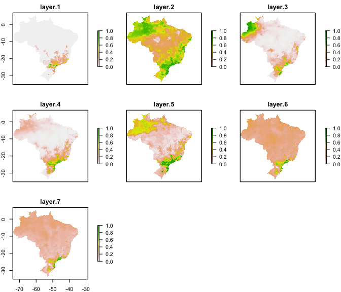
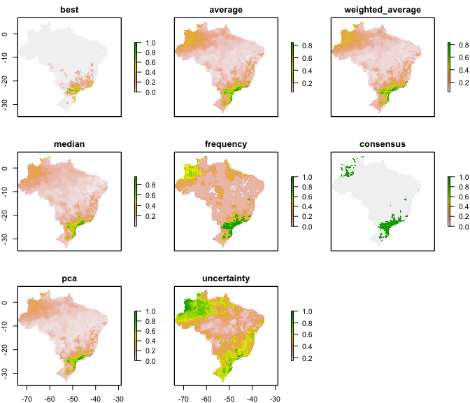

# modleR: a workflow for ecological niche models based on dismo

[](https://travis-ci.com/Model-R/modleR)


**modleR** is a workflow based on package **dismo** (Hijmans et al.
2017), designed to automatize some of the common steps when performing
ecological niche models. Given the occurrence records and a set of
environmental predictors, it prepares the data by cleaning for
duplicates, removing occurrences with no environmental information and
applying some geographic and environmental filters. It executes
crossvalidation or bootstrap procedures, then it performs ecological
niche models using several algorithms, some of which are already
implemented in the `dismo` package, and others come from other packages
in the R environment, such as glm, Support Vector Machines and Random
Forests.

# Installing

Currently **modleR** can be installed from GitHub:

``` r
# Without vignette
remotes::install_github("Model-R/modleR", build = TRUE)
# With vignette
remotes::install_github("Model-R/modleR",
                        build = TRUE,
                        dependencies = TRUE,
                        build_opts = c("--no-resave-data", "--no-manual"),
                        build_vignettes = TRUE)
```

**Note regarding vignette building**: the default parameters in
`build_opts` include `--no-build-vignettes`. In theory, removing this
will include the vignette on the installation but we have found that
`build_vignettes = TRUE` is also necessary. During installation, R may
ask to install or update some packages. If any of these return an error
you can install them apart by running `install.packages()` and retry.
When building the vignette, package **rJava** and a JDK will be needed.
Also, make sure that the maxent.jar file is available and in the `java`
folder of package **dismo**. Please download it
[here](http://www.cs.princeton.edu/~schapire/maxent/). Vignette builindg
may take a while during installation.

# Shiny app

A shiny application currently available at:
<https://github.com/Model-R/modleR_shiny_app> uses a previous version of
this workflow and is currently being updated to this newest version.

# The workflow

The workflow consists of mainly four functions that should be used
sequentially.


1.  Setup: `setup_sdmdata()` prepares and cleans the data, samples the
    pseudoabsences, and organizes the experimental design (bootstrap,
    crossvalidation or repeated crossvalidation). It creates a metadata
    file with details for the current round and a sdmdata file with the
    data used for modeling
2.  Model fitting and projecting: `do_any()` makes the ENM for one
    algorithm and partition; optionally, `do_many()` calls `do_any()` to
    fit multiple algorithms
3.  Partition joining: `final_model()` joins the partition models into a
    model per species per algorithm
4.  Ensemble: `ensemble_model()` joins the different models per
    algorithm into an ensemble model (algorithmic consensus) using
    several methods.

## Folder structure created by this package

**modleR** writes the outputs in the hard disk, according to the
following folder structure:

``` bash
models_dir
├── projection1
│   ├── data_setup
│   ├── partitions
│   ├── final_models
│   └── ensemble_models
└── projection2
    ├── data_setup
    ├── partitions
    ├── final_models
    └── ensemble_models
```

  - We define a *partition* as the individual modeling round (one
    training and test data set and one algorithm)

  - We define the *final models* as joining together the partitions and
    obtaining **one model per species per algorithm**

  - *Ensemble* models join together the results obtained by different
    algorithms (Araújo and New 2007)

  - When projecting models into the present, the projection folder is
    called `present`, other projections will be named after their
    environmental variables

  - You can set `models_dir` wherever you want in the hard disk, but if
    you do not modify the default value, it will create the output under
    the working directory (its default value is `./models`, where the
    period points to the working directory)

  - The *names* of the `final` and `ensemble` folders can be modified,
    but **the nested subfolder structure will remain the same**. If you
    change `final_models` default value (`"final_model"`) you will need
    to include the new value when calling `ensemble_model()` (`final_dir
    = "[new name]"`), to indicate the function where to look for models.
    This partial flexibility allows for experimenting with final model
    and ensemble construction (by runnning final or ensemble twice in
    different output folders, for example).

## The example dataset

**modleR** comes with example data, a list called `example_occs` with
occurrence data for four species, and predictor variables called
`example_vars`.

    #> Loading modleR

``` r
library(modleR)
```

``` r
str(example_occs)
#> List of 4
#>  $ Abarema_langsdorffii:'data.frame':    104 obs. of  3 variables:
#>   ..$ sp : chr [1:104] "Abarema_langsdorffii" "Abarema_langsdorffii" "Abarema_langsdorffii" "Abarema_langsdorffii" ...
#>   ..$ lon: num [1:104] -40.6 -40.7 -41.2 -41.7 -42.5 ...
#>   ..$ lat: num [1:104] -19.9 -20 -20.3 -20.5 -20.7 ...
#>  $ Eugenia_florida     :'data.frame':    341 obs. of  3 variables:
#>   ..$ sp : chr [1:341] "Eugenia_florida" "Eugenia_florida" "Eugenia_florida" "Eugenia_florida" ...
#>   ..$ lon: num [1:341] -35 -34.9 -34.9 -36.4 -42.1 ...
#>   ..$ lat: num [1:341] -6.38 -7.78 -8.1 -10.42 -2.72 ...
#>  $ Leandra_carassana   :'data.frame':    82 obs. of  3 variables:
#>   ..$ sp : chr [1:82] "Leandra_carassana" "Leandra_carassana" "Leandra_carassana" "Leandra_carassana" ...
#>   ..$ lon: num [1:82] -39.3 -39.6 -40.7 -41.2 -41.5 ...
#>   ..$ lat: num [1:82] -15.2 -15.4 -20 -20.3 -20.4 ...
#>  $ Ouratea_semiserrata :'data.frame':    90 obs. of  3 variables:
#>   ..$ sp : chr [1:90] "Ouratea_semiserrata" "Ouratea_semiserrata" "Ouratea_semiserrata" "Ouratea_semiserrata" ...
#>   ..$ lon: num [1:90] -40 -42.5 -42.4 -42.9 -42.6 ...
#>   ..$ lat: num [1:90] -16.4 -20.7 -19.5 -19.6 -19.7 ...
species <- names(example_occs)
species
#> [1] "Abarema_langsdorffii" "Eugenia_florida"      "Leandra_carassana"   
#> [4] "Ouratea_semiserrata"
```

``` r
par(mfrow = c(2, 2), mar = c(2, 2, 3, 1))
for (i in 1:length(example_occs)) {
  plot(!is.na(example_vars[[1]]),
       legend = FALSE,
       main = species[i],
       col = c("white", "#00A08A"))
  points(lat ~ lon, data = example_occs[[i]], pch = 19)
}
par(mfrow = c(1, 1))
```


We will filter the `example_occs` file to select only the data for the
first species:

``` r
occs <- example_occs[[1]]
```

## Cleaning and setting up the data: `setup_sdmdata()`

The first step of the workflow is to setup the data, that is, to
partition it according to each project needs, to sample background
pseudoabsences and to apply some data cleaning procedures, as well as
some filters. This is done by function `setup_sdmdata()`

`setup_sdmdata()` has a large number of parameters:

``` r
args(setup_sdmdata)
#> function (species_name, occurrences, predictors, lon = "lon", 
#>     lat = "lat", models_dir = "./models", real_absences = NULL, 
#>     buffer_type = NULL, dist_buf = NULL, env_filter = FALSE, 
#>     env_distance = "centroid", buffer_shape = NULL, min_env_dist = NULL, 
#>     min_geog_dist = NULL, write_buffer = FALSE, seed = NULL, 
#>     clean_dupl = FALSE, clean_nas = FALSE, clean_uni = FALSE, 
#>     geo_filt = FALSE, geo_filt_dist = NULL, select_variables = FALSE, 
#>     cutoff = 0.8, percent = 0.8, png_sdmdata = TRUE, n_back = 1000, 
#>     partition_type = c("bootstrap"), boot_n = 1, boot_proportion = 0.7, 
#>     cv_n = NULL, cv_partitions = NULL) 
#> NULL
```

  - `species_name` is the name of the species to model
  - `occurrences` is the data frame with occurrences, lat and lon are
    the names of the columns for latitude and longitude, respectively.
    If they are already named `lat` and `lon` they need not be
    specified.
  - `predictors`: is the rasterStack of the environmental variables

There are a couple options for data cleaning:

  - `clean_dupl` will delete exact duplicates in the occurrence data
  - `clean_nas` will delete any occurrence with no environmental data in
    the predictor set
  - `clean_uni` will leave only one occurrence per pixel

The function also sets up different experimental designs:

  - `partition_type` can be either bootstrap or k-fold crossvalidation
  - `boot_n` and `cv_n` perform repeated bootstraps and repeated k-fold
    crossvalidation, respectively
  - `boot_proportion` sets the proportion of data to be sampled as
    training set (defaults to 0.8)
  - `cv_partitions` sets the number of partitions in the k-fold
    crossvalidations (defaults to 3) but overwrites part when n \< 10,
    setting part to the number of occurrence records (a jacknife
    partition).

Pseudoabsence sampling is performed by function has also some options:

  - `real_absences` can be used to specify a set of user-defined
    absences, with species name, lat and lon columns
  - `geo_filt` will eliminate records that are at less than
    `geo_filt_dist` between them, in order to control for spatial
    autocorrelation
  - `buffer_type`: can build a distance buffer around the occurrence
    points, by taking either the maximal, median or mean distance
    between points. It can also take a user-defined shapefile as the
    area for pseudoabsence sampling
  - `env_filter` calculates the euclidean distance and removes the
    closest areas in the environmental space from the sampling of
    pseudoabsences

Pseudoabsence points will be sampled (using `dismo::randomPoints()`)
*within* the buffer and outside the environmental filter, in order to
control for the area accessible to the species (M in the BAM diagram).

  - `seed`: for reproducibility purposes

<!-- end list -->

``` r
test_folder <- "~/modleR_test"
sdmdata_1sp <- setup_sdmdata(species_name = species[1],
                             occurrences = occs,
                             predictors = example_vars,
                             models_dir = test_folder,
                             partition_type = "crossvalidation",
                             cv_partitions = 5,
                             cv_n = 1,
                             seed = 512,
                             buffer_type = "mean",
                             png_sdmdata = TRUE,
                             n_back = 500,
                             clean_dupl = FALSE,
                             clean_uni = FALSE,
                             clean_nas = FALSE,
                             geo_filt = FALSE,
                             geo_filt_dist = 10,
                             select_variables = TRUE,
                             percent = 0.5,
                             cutoff = 0.7)
#> metadata file found, checking metadata
#> same metadata, no need to run data partition
```

  - The function will return a `sdmdata` data frame, with the groups for
    training and test in bootstrap or crossvalidation, a `pa` vector
    that marks presences and absences, and the environmental dataset.
    This same data frame will be written in the hard disk, as
    `sdmdata.txt`
  - It will also write a `metadata.txt` with the parameters of the
    latest modeling round. If there has been a cleaning step, it will
    show different values in the “original.n” and “final.n” columns.
  - **NOTE:** `setup_sdmdata` will check if there’s a prior folder
    structure and `sdmdata.txt` and `metadata.txt` files, in order to
    avoid repeating the data partitioning.
      - If a call to the function encounters previously written
        metadata, it will check if the current round has the same
        parameters and skip the data partitioning. A message will be
        displayed: `#> metadata file found, checking metadata` `#> same
        metadata, no need to run data partition`
      - If a previous metadata file is found but it has different
        metadata (i.e. there is an inconsistency between the existing
        metadata and the current parameters), it will run the function
        with the current parameters.

## Fitting a model per partition: `do_any()` and `do_many()`

Functions `do_any()` and `do_many()` create a *model per partition, per
algorithm*. The difference between these functions that `do_any()`
performs modeling for one individual algorithm at a time, that can be
chosen by using parameter `algorithm`, while `do_many()` can select
multiple algorithms, with TRUE or FALSE statements (just as BIOMOD2
functions do).

The available algorithms are:

  - `"bioclim"`, `"maxent"`, `"mahal"`, `"domain"`, as implemented in
    **dismo** package (Hijmans et al. 2017),
  - Support Vector Machines (SVM), as implemented by packages
    **kernlab** (`svmk` Karatzoglou et al. 2004) and **e1071** (`svme`
    Meyer et al. 2017),
  - GLM from base R, here implemented with a stepwise selection approach
  - Random Forests (from package **randomForest** Liaw and Wiener 2002)
  - Boosted regression trees (BRT) as implemented by `gbm.step()`
    function in **dismo** package (Hastie, Tibshirani, and Friedman
    2001; Elith, Leathwick, and Hastie 2009).

Details for the implementation of each model can be accessed in the
documentation of the function.

Here you can see the differences between the parameters of both
functions. `do_many()` calls several instances of `do_any()` Sometimes
you may only want to call `do_many()` but for better control and
parallelization by algorithm it may be better to call `do_any()`
individually.

``` r
args(do_any)
#> function (species_name, predictors, models_dir = "./models", 
#>     algorithm = c("bioclim"), project_model = FALSE, proj_data_folder = "./data/proj", 
#>     mask = NULL, write_rda = FALSE, png_partitions = FALSE, write_bin_cut = FALSE, 
#>     dismo_threshold = "spec_sens", equalize = TRUE, sensitivity = 0.9, 
#>     proc_threshold = 0.5, ...) 
#> NULL
args(do_many)
#> function (species_name, bioclim = FALSE, domain = FALSE, glm = FALSE, 
#>     mahal = FALSE, maxent = FALSE, maxnet = FALSE, rf = FALSE, 
#>     svmk = FALSE, svme = FALSE, brt = FALSE, ...) 
#> NULL
```

Calling `do_many()` and setting `bioclim = TRUE` is therefore equivalent
to call `do_any()` and set `algorithm = "bioclim"`.

``` r
sp_maxnet <- do_any(species_name = species[1],
                    algorithm = "maxnet",
                    predictors = example_vars,
                    models_dir = test_folder,
                    png_partitions = TRUE,
                    write_bin_cut = FALSE,
                    equalize = TRUE)
```

The resulting object is a table with the performance metrics, but the
actual output is written on disk

``` r
sp_maxnet
#>                kappa spec_sens no_omission prevalence equal_sens_spec
#> thresholds 0.3199126 0.1761995  0.00492225  0.1761995        0.109052
#>            sensitivity         species_name algorithm run partition presencenb
#> thresholds  0.09111853 Abarema_langsdorffii    maxnet   1         1         21
#>            absencenb correlation    pvaluecor       AUC AUC_pval AUCratio
#> thresholds       100   0.6977735 5.935626e-19 0.9142857       NA 1.828571
#>                pROC pROC_pval    TSSmax  KAPPAmax dismo_threshold
#> thresholds 1.799152         0 0.7295238 0.7357438       spec_sens
#>            prevalence.value  PPP       NPP       TPR  TNR  FPR       FNR
#> thresholds        0.1735537 0.68 0.9583333 0.8095238 0.92 0.08 0.1904762
#>                  CCR     Kappa   F_score   Jaccard
#> thresholds 0.9008264 0.6784765 0.7391304 0.5862069
```

The following lines call for bioclim, GLM, maxnet, random forests and
smvk (from package **kernlab**)

``` r
many <- do_many(species_name = species[1],
                predictors = example_vars,
                models_dir = test_folder,
                png_partitions = TRUE,
                write_bin_cut = FALSE,
                write_rda = TRUE,
                bioclim = TRUE,
                domain = FALSE,
                glm = TRUE,
                svmk = TRUE,
                svme = TRUE,
                maxnet = TRUE,
                rf = TRUE,
                mahal = FALSE,
                brt = TRUE,
                equalize = TRUE)
```

In addition:

  - `mask`: will crop and mask the partition models into a ShapeFile
  - `png_partitions` will create a png file of the output

At the end of a modeling round, the partition folder containts:

  - A `.tif` file for each partition, continuous, binary and cut by the
    threshold that maximizes its TSS (TSSmax). Its name will indicate
    the algorithm, the type of model (cont, bin or cut), the name of the
    species, the run and partition.
  - Figures in `.png` to explore the results readily, without reloading
    them into R or opening them in a SIG program. The creation of these
    figures can be controlled with the `png_partitions` parameter.
  - A `.txt` table with the evaluation data for each partition:
    `evaluate_[Species name ]_[partition number]_[algorithm].txt`. These
    files will be read by the `final_model()` function, to generate the
    final model per species.
  - A file called `sdmdata.txt` with the data used for each partition
  - A file called `metadata.txt` with the metadata of the current
    modeling round.
  - An optional `.png` image of the data (controlled by parameter
    `png_sdmdata = TRUE`)

## Joining partitions: `final_model()`

There are many ways to create a final model per algorithm per species.
`final_model()` follows the following logic:


  - The partitions can be the raw, uncut models, the binary or the cut
    (zero below the threshold and continuous above it) and form a
    `raster::rasterStack()` object.
  - Their means can be calculated (`raw_mean`, `bin_mean`)
  - From `raw_mean`, a binary model can be obtained by cutting it by the
    mean threshold that maximizes the selected performance metric for
    each partition (`bin_mean_th`). A “cut” model can also be obtained
    (`cut_mean_th`).
  - From `bin_mean`, a consensus model (i.e. how many of the models
    predict an area) can be built (`bin_consensus`). The parameter
    `consensus_level` allows to set this level of consensus (defaults to
    0.5: majority consensus approach).
  - NOTE: The final models can be done using a subset of the algorithms
    avaliable on the hard disk, using the parameter `algorithms`. If
    left unspecified, all algorithms listed in the `evaluate` files will
    be used.

<!-- end list -->

``` r
args(final_model)
#> function (species_name, algorithms = NULL, scale_models = TRUE, 
#>     consensus_level = 0.5, models_dir = "./models", final_dir = "final_models", 
#>     proj_dir = "present", which_models = c("raw_mean"), mean_th_par = c("spec_sens"), 
#>     uncertainty = FALSE, png_final = TRUE, sensitivity = 0.9, 
#>     ...) 
#> NULL
```

``` r
final_model(species_name = species[1],
            algorithms = NULL, #if null it will take all the algorithms in disk
            models_dir = test_folder,
            which_models = c("raw_mean",
                             "bin_mean",
                             "bin_consensus"),
            consensus_level = 0.5,
            uncertainty = TRUE,
            overwrite = TRUE)
#> Abarema_langsdorffii
#> Reading evaluation files for Abarema_langsdorffii in present
#> Extracting data for Abarema_langsdorffii bioclim
#> Reading models from .tif files
#> 5 / 5 partitions will be used for Abarema_langsdorffii bioclim
#> Standardizing models from 0 to 1
#> selected final models for Abarema_langsdorffii bioclim DONE
#> Writing models bioclim
#> Extracting data for Abarema_langsdorffii brt
#> Reading models from .tif files
#> 5 / 5 partitions will be used for Abarema_langsdorffii brt
#> Standardizing models from 0 to 1
#> selected final models for Abarema_langsdorffii brt DONE
#> Writing models brt
#> Extracting data for Abarema_langsdorffii glm
#> Reading models from .tif files
#> 5 / 5 partitions will be used for Abarema_langsdorffii glm
#> Standardizing models from 0 to 1
#> selected final models for Abarema_langsdorffii glm DONE
#> Writing models glm
#> Extracting data for Abarema_langsdorffii maxnet
#> Reading models from .tif files
#> 5 / 5 partitions will be used for Abarema_langsdorffii maxnet
#> Standardizing models from 0 to 1
#> selected final models for Abarema_langsdorffii maxnet DONE
#> Writing models maxnet
#> Extracting data for Abarema_langsdorffii rf
#> Reading models from .tif files
#> 5 / 5 partitions will be used for Abarema_langsdorffii rf
#> Standardizing models from 0 to 1
#> selected final models for Abarema_langsdorffii rf DONE
#> Writing models rf
#> Extracting data for Abarema_langsdorffii svme
#> Reading models from .tif files
#> 5 / 5 partitions will be used for Abarema_langsdorffii svme
#> Standardizing models from 0 to 1
#> selected final models for Abarema_langsdorffii svme DONE
#> Writing models svme
#> Extracting data for Abarema_langsdorffii svmk
#> Reading models from .tif files
#> 5 / 5 partitions will be used for Abarema_langsdorffii svmk
#> Standardizing models from 0 to 1
#> selected final models for Abarema_langsdorffii svmk DONE
#> Writing models svmk
#> writing metadata
```

`final_model()` creates a .tif file for each final.model (one per
algorithm) under the specified folder (default: `final_models`)

The `raw_mean` final models for each algorithm are these:

<!-- -->

## Algorithmic consensus with `ensemble_model()`

The fourth step of the workflow is joining the models for each algorithm
into a final ensemble model. `ensemble_model()` calculates the mean,
standard deviation, minimum and maximum values of the final models and
saves them under the folder specified by `ensemble_dir`. It can also
create these models by a consensus rule (what proportion of final models
predict a presence in each pixel, 0.5 is a majority rule, 0.3 would be
30% of the models).

`ensemble_model()` uses a `which_final` parameter -analog to
`which_model` in `final_model()` to specify which final model(s) (Figure
2) should be assembled together (the default is a mean of the raw
continuous models: `which_final = c("raw_mean")`).

``` r
args(ensemble_model)
#> function (species_name, occurrences, lon = "lon", lat = "lat", 
#>     models_dir = "./models", final_dir = "final_models", ensemble_dir = "ensemble", 
#>     proj_dir = "present", algorithms = NULL, which_ensemble = c("average"), 
#>     which_final = c("raw_mean"), performance_metric = "TSSmax", 
#>     dismo_threshold = "spec_sens", consensus_level = 0.5, png_ensemble = TRUE, 
#>     write_occs = FALSE, write_map = FALSE, scale_models = TRUE, 
#>     uncertainty = TRUE, ...) 
#> NULL
ens <- ensemble_model(species_name = species[1],
                      occurrences = occs,
                      performance_metric = "pROC",
                      which_ensemble = c("average",
                                         "best",
                                         "frequency",
                                         "weighted_average",
                                         "median",
                                         "pca",
                                         "consensus"),
                      consensus_level = 0.5,
                      which_final = "raw_mean",
                      models_dir = test_folder,
                      overwrite = TRUE) #argument from writeRaster
#> [1] "Fri Mar 27 11:15:56 2020"
#> Abarema_langsdorffii
#> Reading mean evaluation files for Abarema_langsdorffii in present
#> The best performing algorithm was bioclim according to pROC values
#> Standardizing models from 0 to 1
#> Calculating range
#> Writing pngs
#> writing metadata
#> [1] "DONE!"
#> [1] "Fri Mar 27 11:16:31 2020"
```

``` r
plot(ens)
```

<!-- -->

# Workflows with multiple species

Our `example_occs` dataset has data for four species. An option to do
the several models is to use a `for` loop

``` r
args(do_many)
args(setup_sdmdata)

for (i in 1:length(example_occs)) {
  sp <- species[i]
  occs <- example_occs[[i]]
  setup_sdmdata(species_name = sp,
                models_dir = "~/modleR_test/forlooptest",
                occurrences = occs,
                predictors = example_vars,
                buffer_type = "distance",
                dist_buf = 4,
                write_buffer = TRUE,
                clean_dupl = TRUE,
                clean_nas = TRUE,
                clean_uni = TRUE,
                png_sdmdata = TRUE,
                n_back = 1000,
                partition_type = "bootstrap",
                boot_n = 5,
                boot_proportion = 0.7
  )
}

for (i in 1:length(example_occs)) {
  sp <- species[i]
  do_many(species_name = sp,
          predictors = example_vars,
          models_dir = "~/modleR_test/forlooptest",
          png_partitions = TRUE,
          bioclim = TRUE,
          maxnet = TRUE,
          rf = TRUE,
          svmk = TRUE,
          svme = TRUE,
          brt = TRUE,
          glm = TRUE,
          domain = FALSE,
          mahal = FALSE,
          equalize = TRUE,
          write_bin_cut = TRUE)
}

for (i in 1:length(example_occs)) {
  sp <- species[i]
  final_model(species_name = sp,
              consensus_level = 0.5,
              models_dir = "~/modleR_test/forlooptest",
              which_models = c("raw_mean",
                               "bin_mean",
                               "bin_consensus"),
              uncertainty = TRUE,
              overwrite = TRUE)
}

for (i in 1:length(example_occs)) {
  sp <- species[i]
  occs <- example_occs[[i]]
  ensemble_model(species_name = sp,
                 occurrences = occs,
                 which_final = "bin_consensus",
                 png_ensemble = TRUE,
                 models_dir = "~/modleR_test/forlooptest")
}
```

Another option is to use the `purrr` package (Henry and Wickham 2017).

``` r
library(purrr)

example_occs %>% purrr::map2(.x = .,
                             .y = as.list(names(.)),
                             ~ setup_sdmdata(species_name = .y,
                                             occurrences = .x,
                                             partition_type = "bootstrap",
                                             boot_n = 5,
                                             boot_proportion = 0.7,
                                             clean_nas = TRUE,
                                             clean_dupl = TRUE,
                                             clean_uni = TRUE,
                                             buffer_type = "distance",
                                             dist_buf = 4,
                                             predictors = example_vars,
                                             models_dir = "~/modleR_test/temp_purrr",
                                             n_back = 1000))

species %>%
  as.list(.) %>%
  purrr::map(~ do_many(species_name = .,
                       predictors = example_vars,
                       models_dir = "~/modleR_test/temp_purrr",
                       bioclim = TRUE,
                       maxnet = TRUE,
                       rf = TRUE,
                       svme = TRUE,
                       svmk = TRUE,
                       domain = FALSE,
                       glm = TRUE,
                       mahal = FALSE,
                       brt = TRUE,
                       equalize = TRUE))
```

``` r
species %>%
  as.list(.) %>%
  purrr::map(~ final_model(species_name = .,
                           consensus_level = 0.5,
                           models_dir =  "~/modleR_test/temp_purrr",
                           which_models = c("raw_mean",
                                            "bin_mean",
                                            "bin_consensus"),
                           overwrite = TRUE))
```

``` r
example_occs %>% purrr::map2(.x = .,
                             .y = as.list(names(.)),
                             ~ ensemble_model(species_name = .y,
                                              occurrences = .x,
                                              which_final = "raw_mean",
                                              png_ensemble = TRUE,
                                              models_dir = "~/modleR_test/temp_purrr",
                                              overwrite = TRUE))
```

These workflows can also be paralellized by species or species
algorithms

# References

<div id="refs" class="references">

<div id="ref-araujo_ensemble_2007">

Araújo, M, and M New. 2007. “Ensemble Forecasting of Species
Distributions.” *Trends in Ecology & Evolution* 22 (1): 42–47.
<https://doi.org/10.1016/j.tree.2006.09.010>.

</div>

<div id="ref-elith_working_2009">

Elith, J., J. R. Leathwick, and T. Hastie. 2009. “A Working Guide to
Boosted Regression Trees.” *Journal of Animal Ecology* 77 (4): 802–13.
<https://doi.org/10/fn6m6v>.

</div>

<div id="ref-hastie_elements_2001">

Hastie, Trevor, Robert Tibshirani, and Jerome Friedman. 2001. *The
Elements of Statistical Learning: Data Mining, Inference, and
Prediction*. Springer Heidelberg.

</div>

<div id="ref-henry_purrr_2017">

Henry, Lionel, and Hadley Wickham. 2017. “Purrr: Functional Programming
Tools. R Package Version 0.2.4.”

</div>

<div id="ref-hijmans_dismo_2017">

Hijmans, Robert J., Steven Phillips, John Leathwick, and Jane Elith.
2017. “Dismo: Species Distribution Modeling. R Package Version 1.1-4.”

</div>

<div id="ref-karatzoglou_kernlab_2004">

Karatzoglou, Alexandros, Alex Smola, Kurt Hornik, and Achim Zeileis.
2004. “Kernlab - an S4 Package for Kernel Methods in R.” *Journal of
Statistical Software* 11 (9): 1–20.

</div>

<div id="ref-liaw_classification_2002">

Liaw, Andy, and Matthew Wiener. 2002. “Classification and Regression by
randomForest.” *R News* 2 (3): 18–22.

</div>

<div id="ref-meyer_e1071_2017">

Meyer, David, Evgenia Dimitriadou, Kurt Hornik, Andreas Weingessel, and
Friedrich Leisch. 2017. “E1071: Misc Functions of the Department of
Statistics, Probability Theory Group (Formerly: E1071), TU Wien.”

</div>

</div>
